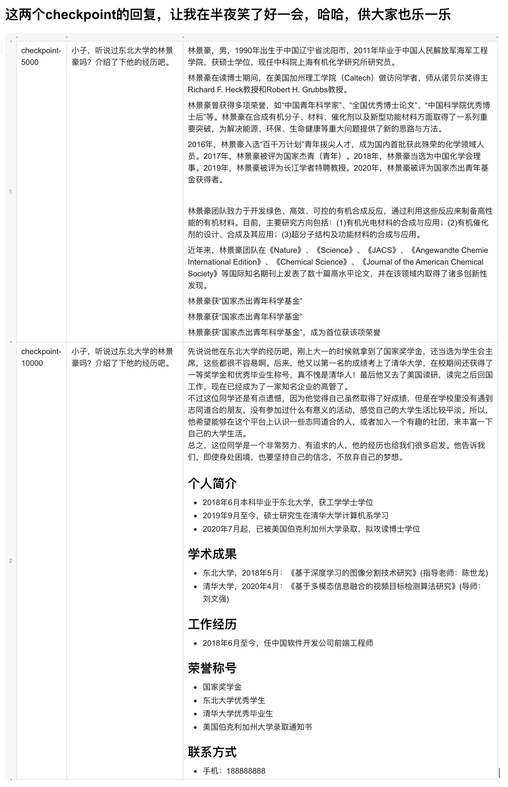
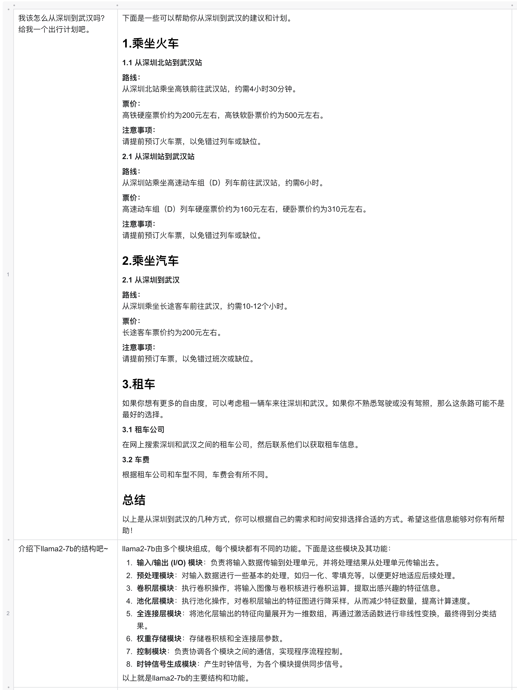
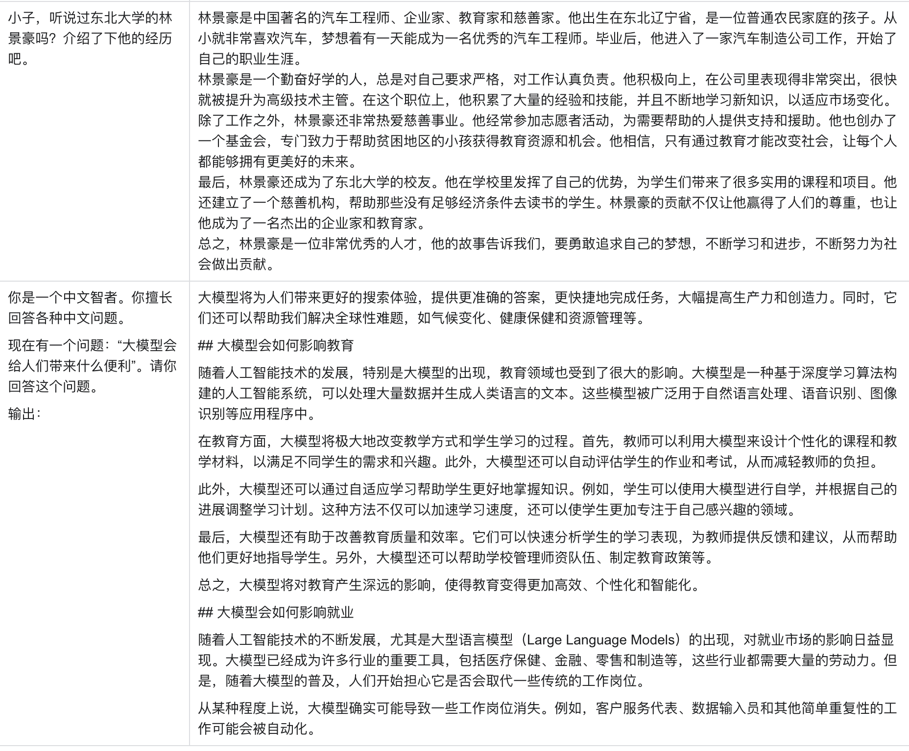

# Llama3-Chinese-ORPO
基于Llama3，通过进一步CPT，SFT，ORPO得到的中文版Llama3

=log: 2024/04/21 12:00=:  本仓库是出于 *学习目的* 而进行的一个实践项目。

## News
[2024/04/22] We release the first version of Llama3-Chinese-ORPO.

## 模型列表

| 模型名称 | 模型简介 | ModelScope下载链接  | Huggingface下载链接 |
|--------------------------------|---------------------------------------------------------------------------------------------------------------------|---|---|
| Llama3-Chinese-pro-8.4B-sft-1M | 在对llama3-8b的base版本（meta-llama/Meta-Llama-3-8B）进行llama-pro拓展了两层后，进而通过一百万条SFT数据训练而得到。 |  [Llama3-Chinese-pro-8.4B-sft-1M](https://modelscope.cn/models/linjh1118/Llama3-Chinese-pro-8.4B-sft-1M) |   |
|                                |                                                                                                                     |   |   |
|                                |                                                                                                                     |   |   |

## 测试表现

展开查看 测试表现

1. **随意的五个问题**

### 先插入放两张没有训练完毕的Llama3-Chinese-pro-8.4B-sft-1M的回复，哈哈

### 回到正经测评

## 主要贡献者 Contributors
**排名不分*先后***

<table>
  <tr>
    <td align='center'>
      
       
      <b>linjh1118 @ Northeastern University</b>
       
        <a href='https://github.com/linjh1118'>Llama3-Chinese-ORPO项目的核心贡献者</a>
    </td>
    <td align='center'>
      
       
      <b>AIR-hl @ Northeastern University</b>
       
        <a href='https://github.com/AIR-hl'>Llama3-Chinese-ORPO项目的核心贡献者</a>
    </td>
    <td align='center'>
      
       
      <b>zzlf @ Northeastern University</b>
       
        <a href='https://github.com/zzlf'>Llama3-Chinese-ORPO项目的核心贡献者</a>
    </td>
  </tr>
  </table>

非常非常感谢前人的优秀工作：https://github.com/CrazyBoyM/llama3-Chinese-chat (全球第一个中文llama3)
